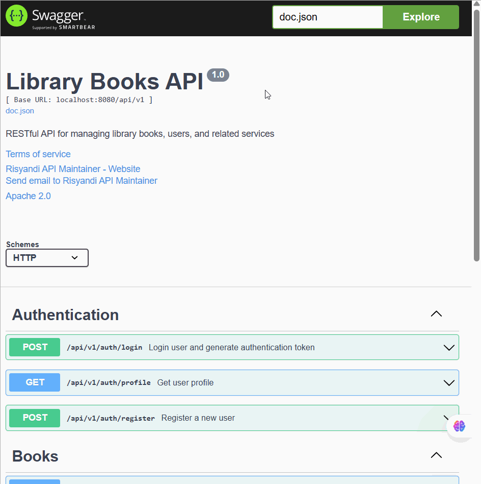

# library-books

A simple library book management project.

## Project Structure

- **backend/**: Contains the server-side code and APIs for managing books, users, and library operations.
- **frontend/**: Contains the client-side application for interacting with the library system.

## Demo

To run the demo locally:

1. **Backend**
   - Navigate to the `backend` folder and follow its setup instructions (e.g., install dependencies, run the server).
2. **Frontend**
   - Navigate to the `frontend` folder and follow its setup instructions (e.g., install dependencies, start the app).

Once both are running, open your browser and visit the frontend URL (usually `http://localhost:3000` or as specified in the frontend setup) to interact with the library system.

## Swagger Docs

  

## Demo Apps

---
Feel free to update this README with more details about setup, usage, or contributing as your project evolves.
